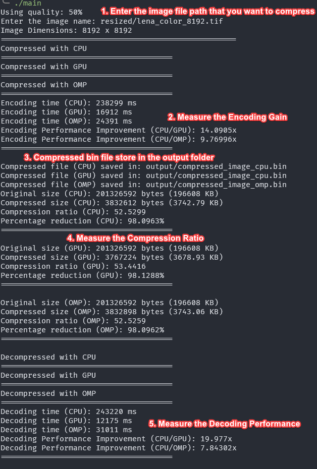
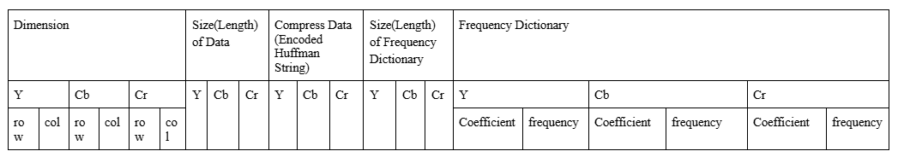
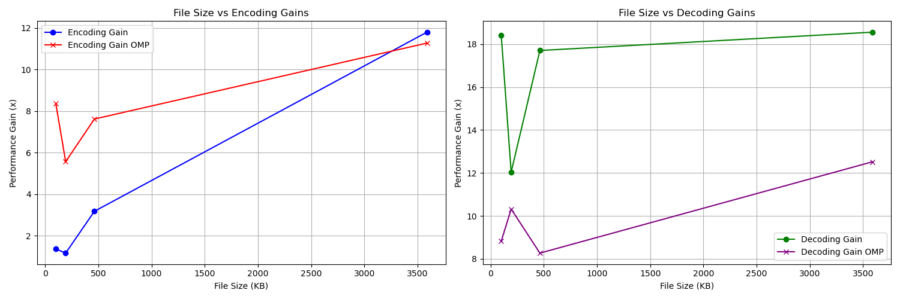
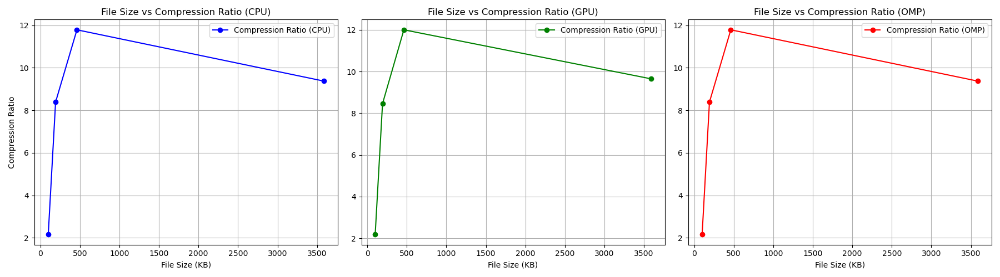
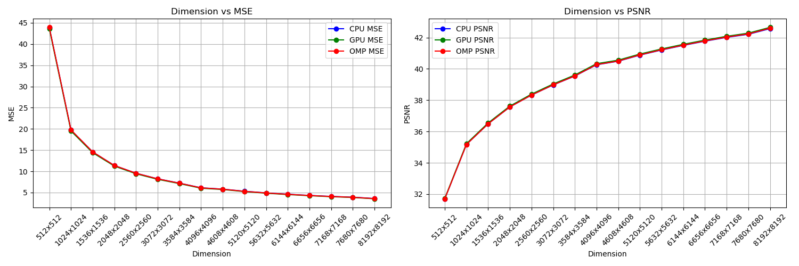
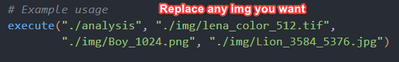
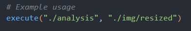

# JPEG Compression and Decompression with CPU, GPU (CUDA), and OpenMP Optimizations


A high-performance implementation of JPEG compression and decompression leveraging CPU multi-threading (OpenMP) and GPU acceleration (CUDA), with comprehensive performance analysis tools.

## Table of Contents

- [Introduction](#introduction)
- [Features](#features)
- [Prerequisites](#prerequisites)
- [Installation](#installation)
- [Usage](#usage)
- [Custom Binary Format](#custom-binary-format)
- [Performance Results](#performance-results)
- [Analysis Tools](#analysis-tools)
- [Project Structure](#project-structure)
- [Contributing](#contributing)
- [License](#license)
- [References](#references)

## Introduction

This project implements JPEG compression and decompression with three parallel computing approaches:

1. **CPU Baseline** (Single-threaded)
2. **GPU Accelerated** (CUDA)
3. **CPU Multi-threaded** (OpenMP)

It includes a custom binary format for compressed data storage and tools to analyze compression ratios, speed gains, and image quality metrics (MSE, PSNR).

## Features

- JPEG compression/decompression with adjustable quality factor (1-100)
- Cross-platform support (tested on Linux/WSL and Google Colab)
- Performance comparison between CPU, GPU, and OpenMP
- Custom binary format for efficient storage
- Python scripts for metric analysis and visualization

## Prerequisites

- **OpenCV 4.5+** (for image I/O and processing)
  ```bash
  sudo apt-get install libopencv-dev
  ```
- **CUDA Toolkit 11.0+** (for GPU acceleration)
- [Installation Guide](https://developer.nvidia.com/cuda-downloads)

  [WSL Installation](https://www.youtube.com/watch?v=JaHVsZa2jTc&ab_channel=NVIDIADeveloper)

  _Note: Requires NVIDIA GPU with compatible drivers_

- **GCC 9+** and **NVCC** (compilers)
- **Python 3.8+** (for analysis scripts)
  ```bash
  pip install numpy opencv-python matplotlib
  ```

## Installation

### Google Colab

[](https://colab.research.google.com/github/Fulim13/jpeg/blob/main/main.ipynb)

### Local Build (Linux/WSL)

1. Clone the repository:
   ```bash
   git clone https://github.com/Fulim13/jpeg.git && cd jpeg
   ```
2. Compile the project:

   ```bash
   # Compile main program
   g++ -c -o main.o main.cpp -fopenmp `pkg-config --cflags --libs opencv4` -std=c++17
   nvcc -c -o kernel.o kernel.cu
   g++ -o main main.o kernel.o -fopenmp `pkg-config --cflags --libs opencv4` -L/usr/local/cuda/lib64 -lcudart

   # Compile analysis tool
   g++ -c -o analysis.o analysis.cpp -fopenmp `pkg-config --cflags --libs opencv4` -std=c++17
   g++ -o analysis analysis.o kernel.o -fopenmp `pkg-config --cflags --libs opencv4` -L/usr/local/cuda/lib64 -lcudart
   ```

## Usage

### Basic Compression/Decompression

```bash
# Default quality factor (50)
./main

# Custom quality factor (e.g., 90)
./main -q 90
```

- **Input**: Images in `img/` (supports `.png`, `.tif`, `.jpg`, ...)
- **Output**:
  - Compressed files: `output/*.bin`
  - Decompressed images: `output/decompress_image_{cpu,gpu,omp}.png`




### Example Outputs

| Original Image (1024×1024)           | CPU Decompressed (QF=50)                   | GPU Decompressed (QF=50)                   | OpenMP Decompressed (QF=50)                |
| ------------------------------------ | ------------------------------------------ | ------------------------------------------ | ------------------------------------------ |
|  |  |  |  |

### Compression Quality Comparison

```bash
# Generate quality comparison image
python3 draw_diff_quality_image.py
```


## Custom Binary Format

The compressed data is stored in a custom binary format with the following header structure:



## Performance Results

For this comparison between CUDA and OMP, we analyzed encoding gains, decoding gains, compression ratios, MSE, and PSNR using the Lena image, ranging in size from 512×512 px to 8192×8192 px.

### Speed Gains vs Image Size



- **GPU Encoding**: Up to 22x faster than CPU for large images (8192×8192)
- **OpenMP Decoding**: Consistent 8x speedup across all sizes

### Compression Ratio



- Higher ratios for larger images due to more redundant data.

### Image Quality Metrics



- **MSE < 45** for all modes, indicating minimal error.
- **PSNR > 30 dB** for all modes, indicating good reconstruction quality.

## Analysis Tools

### Single Image Analysis

Modify `metric_image_file.py` to specify your image path, then run:

```bash
python3 metric_image_file.py
```



### Batch Analysis (Folder)

Update `metric_image_folder.py` with your directory path, then execute:

```bash
python3 metric_image_folder.py
```



## Project Structure

```
.
├── docs/                         # Documentation files
├── img/                          # Sample images
├── jpeg-concept/                 # Test JPEG encode/decode on small 8x8 blocks
├── opencv-concept/               # Test OpenCV Function
├── output/             	  # Compressed binaries and decompressed images
├── result/             	  # Analysis graphs and metrics
├── analysis.cpp        	  # Performance analysis tool
├── encode_decode.cpp             # Compression/decompression logic
├── main.cpp            	  # Main compression/decompression program
├── kernel.cu           	  # CUDA kernels functions
├── image_resize.py     	  # Image resizing utility
├── metric_image_file.py          # Image resizing utility
├── metric_image_folder.py        # Image resizing utility
└── draw_diff_quality_image.py    # Quality factor comparison
```

## Contributing

Contributions are welcome! Please open an issue or submit a pull request for:

- Bug fixes
- Performance improvements
- Additional test cases

## License

This project is licensed under the MIT License. See [LICENSE](LICENSE) for details.

## References

- [JPEG Standard (Wikipedia)](https://en.wikipedia.org/wiki/JPEG)
- [The Webmaster's Definitive Guide to JPEG](https://www.thewebmaster.com/jpeg-definitive-guide/)
- [GitHub Repository: JPEGCompression](https://github.com/PRO-GUNE/JPEGCompression)
- [JPEG Compression Video Tutorial (YouTube)](https://youtu.be/Kv1Hiv3ox8I?si=oN80Ap10Iz0RNnGO)
- [Understanding JPEG Compression (YouTube)](https://youtu.be/0me3guauqOU?si=qpxEaIRUkbqPzu9S)
- [JPEG Compression Playlist (YouTube)](https://youtube.com/playlist?list=PLzH6n4zXuckoAod3z31QEST1ZaizBuNHh&si=UDRfOjOQNS0wnWWG)
- [How JPEG Works (YouTube)](https://youtu.be/umTbivyJoiI?si=zywa_vVxbYHQnjSb)
- [JPEG Compression Explained (YouTube)](https://youtu.be/B3y0RsVCyrw?si=HFpeQjKOG_d_6B0n)
- [Image Database](https://www.imageprocessingplace.com/root_files_V3/image_databases.htm)
