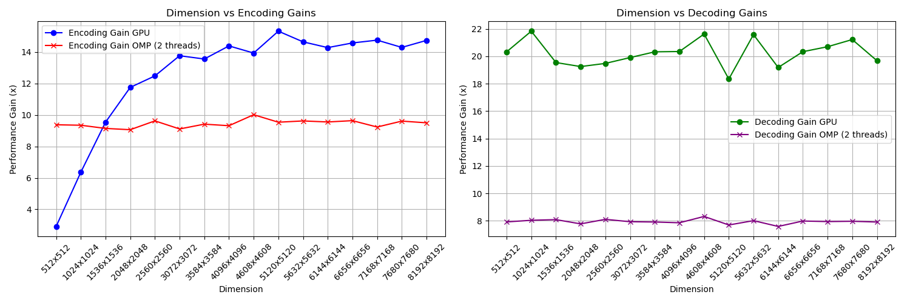
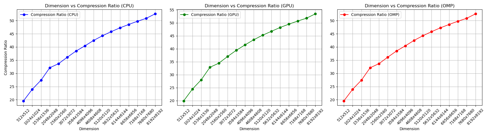

# Install OpenCV

```bash
sudo apt-get install libopencv-dev
```

Check the version of OpenCV installed in your system using the following command:

```bash
pkg-config --modversion opencv4
```

<br />

# Install Cuda

[Install Cuda in WSL](https://www.youtube.com/watch?v=JaHVsZa2jTc&ab_channel=NVIDIADeveloper)

[Cuda Installation Link](https://developer.nvidia.com/cuda-downloads)

<br />

# How to Compile the Main JPEG Compress and Decompress Program

```bash
g++ -c -o main.o main.cpp -fopenmp `pkg-config --cflags --libs opencv4` -std=c++17
nvcc -c -o kernel.o kernel.cu
g++ -o main main.o kernel.o -fopenmp `pkg-config --cflags --libs opencv4` -L/usr/local/cuda/lib64 -lcudart
```

Run it using the following command:

```bash
./main
```

Additionally, If you can specify a quality factor of 90, you can run the following command:
Unfortunately, currently the program only support quality factor of 50(default) and 90.

```bash
./main 90
```

<br />

# Steps to Use the Program


<br />

# Result

For this comparison between CUDA and OMP, we analyzed encoding gains, decoding gains, compression ratios, MSE, and PSNR using the Lena image, ranging in size from 512×512 px to 8192×8192 px.



As shown in Figure, the encoding gain for the GPU compared to the CPU increases as the image dimensions grow. The encoding gain for OMP compared to the CPU remains consistent at around 9–10x. For decoding, the GPU achieves a gain of approximately 18–22x across all dimensions, while OMP achieves a decoding gain of about 8x.



As shown in Figure, the compression ratio for CPU, GPU, and OMP increases as the image dimensions grow.


As shown in Figure, the MSE for CPU, GPU, and OMP decreases as the image dimensions grow. Meanwhile, the PSNR increases for CPU, GPU, and OMP with larger image dimensions.

<br />

# How to Run the Analysis

### 1. Compile the Analysis Program

```bash
g++ -c -o analysis.o analysis.cpp -fopenmp `pkg-config --cflags --libs opencv4` -std=c++17
nvcc -c -o kernel.o kernel.cu
g++ -o analysis analysis.o kernel.o -fopenmp `pkg-config --cflags --libs opencv4` -L/usr/local/cuda/lib64 -lcudart
```

### 2. Run the Analysis Program Using Your Image **File**

In metric_image_file.py, you can change the image file in execute


```
python3 metric_image_file.py
```

### OR 2. Run the Analysis Program Using Your Image **Folder**

In metric_image_folder.py, you can change the image folder in execute


```
python3 metric_image_folder.py
```

<br />

# Other Folder and Files

For the example folder, it is use to test the encode and decode of a small 8x8 pixel block, so that I can understand whether any error in the encoding and decoding process. Feel feel to run the program in the example if you want to understand the encoding and decoding process.

For the img folder, it is use to store the image that I use to test the encoding and decoding process.

For the output folder, it is use to store the compresss bin file and the decompress image file.

- The compressed result is stored in a custom binary format created by me. Below is the structure of the file header for the compressed binary format:
  

For the result folder, it is use to store the result of the analysis. The result such as the metric.csv which store the Encoding Gain, Decoding Gain, Compression Ratio, MSE, and PSNR of the image. The file_size_vs_gains.png, file_size_vs_compression_ratios.png, and file_size_vs_mse_psnr.png are the graph that I plot using the data from the metric.csv.

For the image_resize.py file, it is use to resize the image to the size that I want. Feel free to use it to resize the image to the size that you want.

<br />

## Futher Improvement

- Include More Quantization Tables with different quality

<br />

## References

https://en.wikipedia.org/wiki/JPEG

https://www.thewebmaster.com/jpeg-definitive-guide/

https://github.com/PRO-GUNE/JPEGCompression

https://youtu.be/Kv1Hiv3ox8I?si=oN80Ap10Iz0RNnGO

https://youtu.be/0me3guauqOU?si=qpxEaIRUkbqPzu9S

https://youtube.com/playlist?list=PLzH6n4zXuckoAod3z31QEST1ZaizBuNHh&si=UDRfOjOQNS0wnWWG

https://youtu.be/umTbivyJoiI?si=zywa_vVxbYHQnjSb

https://youtu.be/B3y0RsVCyrw?si=HFpeQjKOG_d_6B0n
